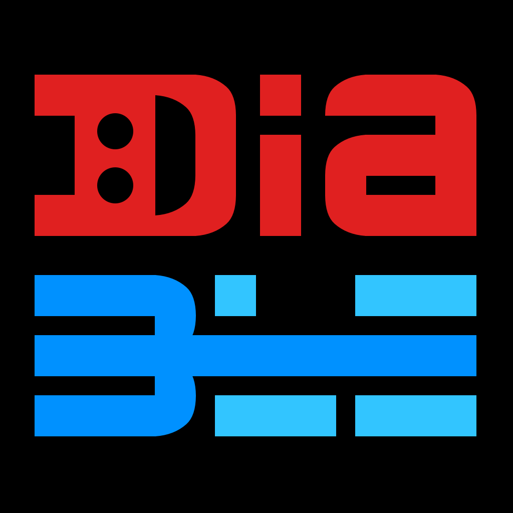

  

Since the FreeStyle **Libre 2 / 3** glucose sensors are Bluetooth Low Energy devices, I am trying to leverage their capabilities to implement something new compared to the traditional apps:

* a universal **SwiftUI** application for iPhone, iPad and Mac Catalyst;
* an **independent Apple Watch app** connecting directly via Bluetooth;
* scanning the Libre directly via **NFC** and exploring its internals;
* using both online servers and offline methods for calibrating just like the **temperature-based** vendor algorithm;
* showing for comparison the **HealthKit** and **Nightscout** data shared with other apps;
* varying the **reading interval** instead of the usual 5-minute one;
* a detailed **log** to check the traffic from/to the BLE devices and remote servers.

Still too early to decide the final design (but I really like already the evil logo 😈), here there are some recent screenshots I tweeted:

  

&nbsp;&nbsp;

<h4 align ="center">Hello Libre 3</h4>
  

The project started as a single script for the iPad Swift Playgrounds to test the workings of the several troublesome BLE devices I bought, mainly the **Bubble** and the **MiaoMiao**. It was then quickly converted to an app when the Libre 2 came out at last by using a standard Xcode template: it should compile fine without external dependencies just after changing the _Bundle Identifier_ in the _General_ panel of the _Targets_ settings and the _Team_ in the _Signing and Capabilities_ tab of Xcode -- Spike and xDrip4iO5 users know already very well what that means... ;-)

I am targeting only the latest betas of Xcode and iOS. The new `async / await` and *actors* introduced in Swift 5.5 and iOS 15 probably would require a total rewrite of DiaBLE's foundations, as well as the enhanced *Gen2* protocols adopted by the recent Libre 2 Sense/US/CA/AU which haven't been reversed yet.

Please refer to the [TODOs](https://github.com/gui-dos/DiaBLE/blob/master/TODO.md) list for the up-to-date status of all the current limitations and known bugs of this prototype.

***Note***: the exploitation which allows to reset and reactivate a Libre 1 is well known to the Vendor and was unveiled already during [BlackAlps 2019](https://www.youtube.com/watch?v=Y9vtGmxh1IQ) and in [PoC||GTFO 0x20](https://archive.org/stream/pocorgtfo20#page/n6/mode/1up).

---
***Credits***: [@bubbledevteam](https://github.com/bubbledevteam), [@captainbeeheart](https://github.com/captainbeeheart), [@cryptax](https://github.com/cryptax), [@dabear](https://github.com/dabear), [@ivalkou](https://github.com/ivalkou), [@keencave](https://github.com/keencave), [LibreMonitor](https://github.com/UPetersen/LibreMonitor/tree/Swift4), [Loop](https://github.com/LoopKit/Loop), [Marek Macner](https://github.com/MarekM60), [Nightguard]( https://github.com/nightscout/nightguard), [@travisgoodspeed](https://github.com/travisgoodspeed), [WoofWoof](https://github.com/gshaviv/ninety-two), [xDrip+](https://github.com/NightscoutFoundation/xDrip), [xDrip4iO5](https://github.com/JohanDegraeve/xdripswift).

###### ***Disclaimer: the decrypting keys I am publishing are not related to user accounts and can be dumped from the sensor memory by using DiaBLE itself. The online servers I am using probably are tracking your personal data but all the traffic sent/received by DiaBLE is clearly shown in its logs. The reversed code I am pasting has been retrieved from other GitHub repos or reproduced simply by using open-source tools like `jadx-gui`.***

